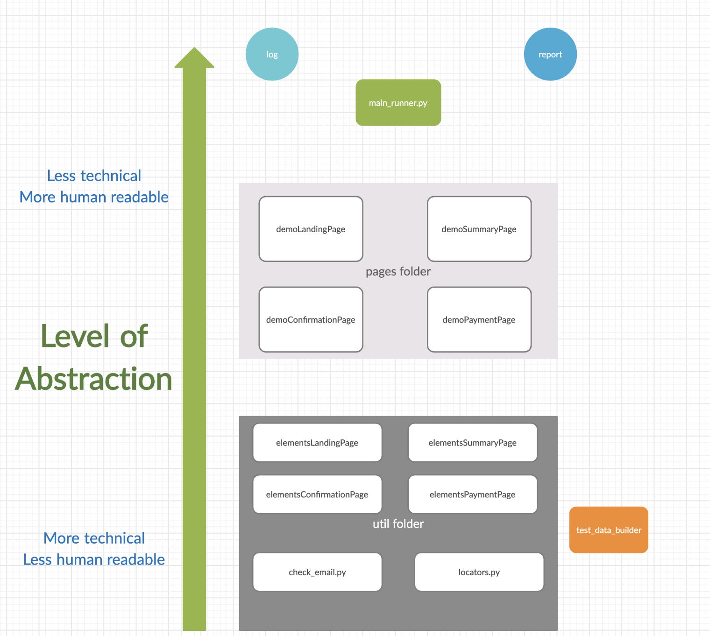
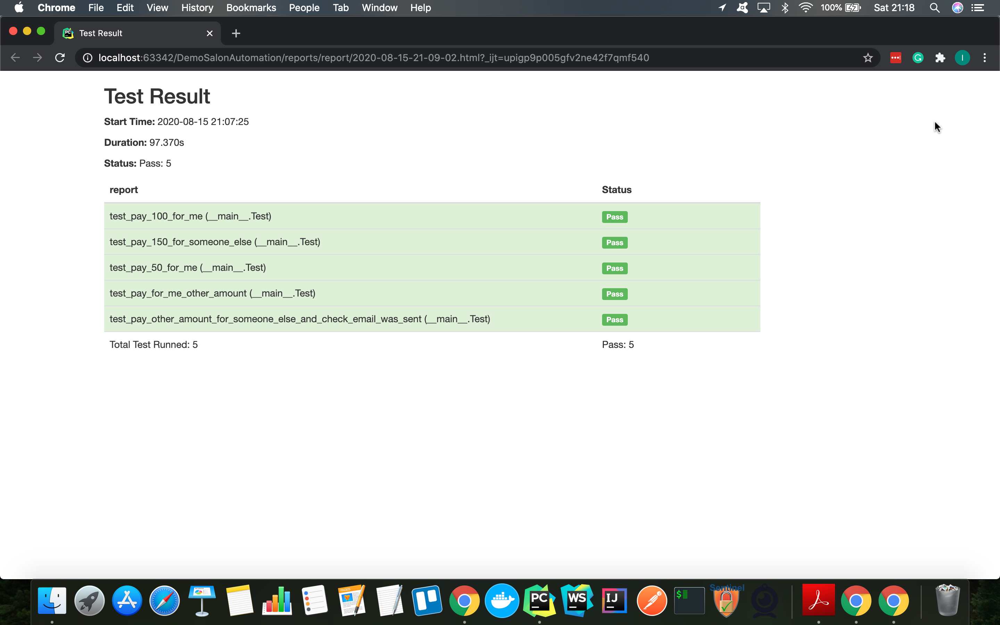
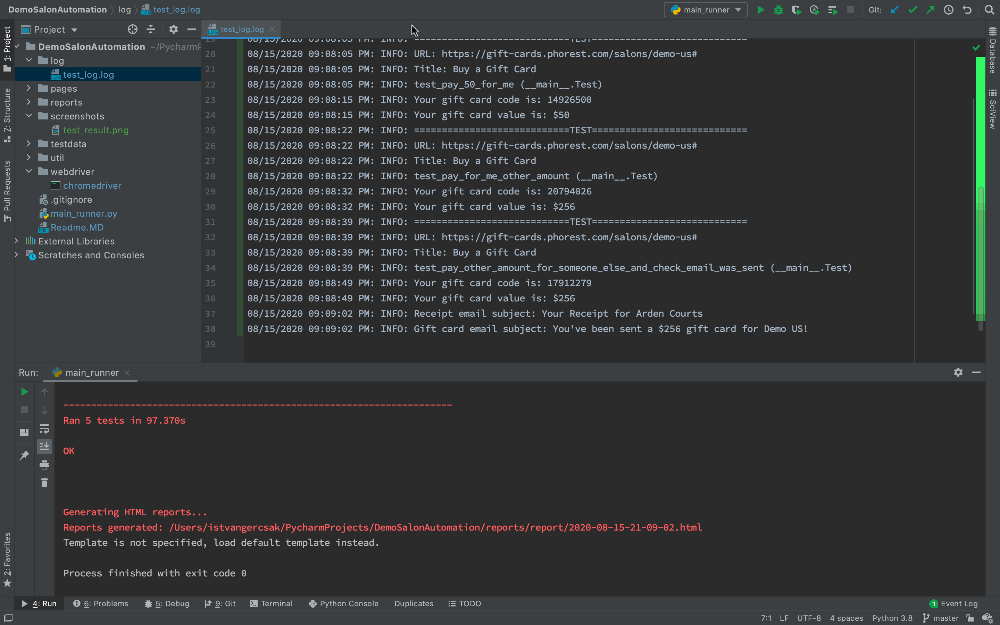

# Test automation framework for Phorest salon software demo

I've built this test automation framework to demonstrate my knowledge and profession about how to build a test automation framework
using Python with selenium. The framework contains logging and reporting functions.

## What kind of tests did I write?

 - I write test cases as it would be used as test automation regression pack.
I think to use test automation is not to find new bugs but get confidence about the working of the software
With keep this in mind I didn't write test cases for field validations and negative tests.

## Problem that I have to solve

- We allow our clients to sell gift cards and vouchers online.
- We want you to prepare an end to end ui set of tests for the voucher purchasing flow.
- Cover the main purchase flow, making sure the users can purchase a voucher for themselves or
 for someone else and see confirmation page/receive email.
- A set of scripts/tests in your preferred programming language.

# Architecture

-  The architecture is following abstraction and modularization so in this way the framework fulfills the 
main non-functional test characteristics like maintainability and learnability.

- Page object model (POM)
    - Separate elements in one place
        - In this way if we want to change or maintain element locations, it is easier to change at only one place
    - Separate locators in one place
        - With these locators there is an additional explicit wait. I use this approach in order to avoid code duplications
        and maintain easier code readability
    - The test contain only abstract non-technical steps
        - With this I could separate the higher level business related steps and the technical lower level commands
    - The pages files contains the technical steps
        - These files are responsible the technical part of the framework, like assertions and locate elements.

- In the test_data.py file I build up test file structure for the customer and the card. 
In this way it was easier and straightforward to implement test cases.

- The main_runner.py file contains the test cases:
    I use the built in python unit test runner. It helps to us to build and organize tests and describe prerequisites like
    set up the webdriver and organize the after events like close and quit the browser.

- Log to follow up the actions during the tests

- Reports in order to see the results in a more readable and colorful format

- Check email functions: There is a separate function to check the incoming emails(more details about this below)

# Scenarios

I've differentiate 4 main scenario that could cover the functionality of the demo page.
These tests are End to End tests that are checking the the payment process flow.

- **Scenario:** Pay with a picked amount($50 and $100) and send to me
    - I fill the details on the landing page
    - I click on the Checkout button
    - On the Summary page check the details
    - I click on confirm details button
    - On the payment page I check the summary details and fill out the card details
    - I click on the Submit button
    - I check the right details on the purchase complete page and check the emails arrived
    - I click on the Done button
    - I arrive on the landing page
    
    
- **Scenario:** Pay with a picked amount($150) and send to someone else
    - I fill the details on the landing page
    - I click on the Checkout button
    - On the Summary page check the details
    - I click on confirm details button
    - On the payment page I check the summary details and fill out the card details
    - I click on the Submit button
    - I check the right details on the purchase complete page and check the emails arrived
    - I click on the Done button
    - I arrive on the landing page

- **Scenario:** Pay with other amount ($256) and send to me
    - I fill the details on the landing page with other amount
    - I click on the Checkout button
    - On the Summary page check the details
    - I click on confirm details button
    - On the payment page I check the summary details and fill out the card details
    - I click on the Submit button
    - I check the right details on the purchase complete page and check the emails arrived
    - I click on the Done button
    - I arrive on the landing page
    
- **Scenario:** Pay with other amount ($256) and send to someone else and check emails
    - I fill the details on the landing page with other amount and send it to someone else
    - I click on the Checkout button
    - On the Summary page check the details
    - I click on confirm details button
    - On the payment page I check the summary details and fill out the card details
    - I click on the Submit button
    - I check the right details on the purchase complete page and check the emails arrived
    - I click on the Done button
    - I arrive on the landing page

## Checking emails arrives

 - Mailosaur: [link](http://mailosaur.com/)
    - Mailosaur is email testing software that lets you capture and test email, helping you build, test and present your product.
    It has a 14 days of free trial version

I use this functionality only in the last (5.) test scenario because I get two emails at the same time if the recipient and the buyer is the same.
The given tool has a limitation to track only one email.

The Mailosaur offer different mailing servers and API-s for them. Thanks for this I can check whether the emails are arrived 
at the mail servers with the predefined mail subject or not.

# Bug

- I didn't find any bug

# Report

- I use a third party library called pyunitreport which is using HTMLTestRunner and create html reports and put it into the reports folder
- The test runner is creating new report after each run
- The report contains: running times, test names, duration, test status,

# Log

- I use built in a logging folder where I could uniquely customize the logging format.
- The log is automatically updates itself after each run

# Technical stack

- IntelliJ PyCharm development environment
- Python 3.8
- Selenium webdriver
- Git and Github for version controlling
- Third party libraries (selenium, pyunitreport, mailosaur)
- Third party software (Milosaur)

## Selenium webdriver

I use Selenium Webdriver to automate the GUI part of the demo.

 - Version: ChromeDriver 83.0.4103.39
 - Browser: Chrome
 - OS version: Mac
 
# How to run and perform tests

1. Fork project from github
2. Install python 3.8
3. Install additional libraries
    - selenium
        - GUI automation library
    - pyunitreport
        - Reporting library
    - mailosaur
        - Email checking API
4. Run the main_runner.py to execute tests
5. Check the log files for traceback
6. Check the report files about the result of the test run

# Features left to implement

In some cases if we want to increase the confidence we can expand the test suites with new tests that are 
empathize strictly the UI parts like:
   - Placeholders
   - Checking input formats
   - Checking required fields
   - Checking whether the software is working correctly and the all the elements are available in smaller resolution 
    as well like on mobile or tablet resolution
   - Checking the Edit function which bring us back to the landing page with the given details
    